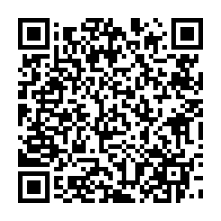
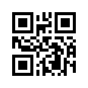
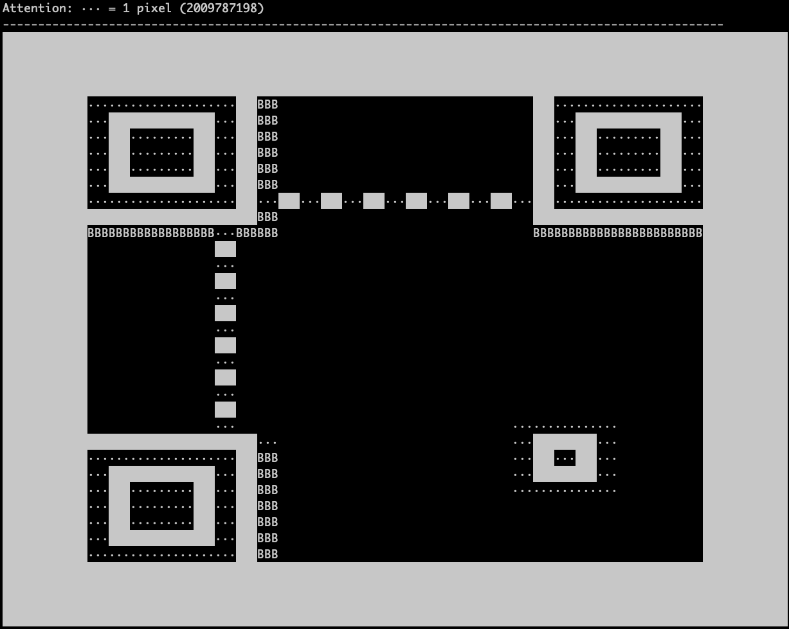

# Challenge 31 - Write Your Own QR Code Generator

This is the challenge 30 from the Coding Challenges by John Crickett https://codingchallenges.fyi/challenges/challenge-qr-generator

## Description

This solution implements a QR code based on the standard ISO/IEC 18004:2015.

- implemented all quality types L M Q H
- implemented all modes: numeric, alphanumeric, byte and kanji
- implemented all sizes of the QR codes based on the bits used


### Final result

Following QR Code is  "This was an awesome challenge - visit  https://codingchallenges.fyi for more"




## Build

Open Intellij or any other IDE with gradle support. run "installDist"

## Tests

Run test cases using gradle "test" command. checkout many test files for bit converter, qr code, qr mode, regions, version

## Usage

### Commandline parameters

I am using picocli to parse arguments

```bash
./qr.sh -h
Usage: qr [-hvV] [-vv] [-vvv] [-vvvv] [-o=<outputFileName>] [-q=<quality>]
          [-s=<squareSize>] <data>
This challenge is to build your own QR Code Generator
      <data>             passes a string to create a QR code
  -h, --help             Show this help message and exit.
  -o=<outputFileName>    -o specifies an optional output file for the generated
                           code. default random generated name
  -q=<quality>           -q specificies an optional quality name: L M Q H -
                           default Q
  -s=<squareSize>        -s specifies an optional size of each pixel - default 5
  -v                     -v specifies verbose mode level 1 included in 2 and 3
                           - default none
  -V, --version          Print version information and exit.
      -vv                -vv specifies verbose mode level 2 included in 3 -
                           default none
      -vvv               -vvv specifies verbose mode level 3 - default none
      -vvvv              -vvvv specifies verbose mode level 4 - default none
```

### Examples: 


run for "HELLO WORLD" and open the random generated name for qr code file
```bash
./qr.sh "HELLO WORLD" -q L -o "HELLO_WORLD.png"
QR code created: qr-e6a30564-2798-4b4a-ac31-4f2b9c2e6b20.png
```



run for "Congratulations Challenge Complete" with quality L and square size 10
```bash
./qr.sh "Congratulations Challenge Complete" -q L -s 10 -o "Congratulations-Challenge-Complete.png"
QR code created: Congratulations-Challenge-Complete.png
```


### Debugging:
You can debug your QR generation flow while adding -v, -vv, -vvv, -vvvv

- -v showing mask information
- -vv showing the final result in text mode and more details of the masking process (all penalties)
- -vvv showing every step of the creation of the QR code - blocks, ... bits, version, ....
- -vvvv showing the most debug for all steps


run for "Congratulations Challenge Complete" but now with level verbose -v or -vv or -vvv or -vvvv
```bash
./qr.sh "Congratulations Challenge Complete" -v -q L -s 10 -o "Congratulations-Challenge-Complete.png"
Mask 0 total   = 784
Mask 1 total   = 749
Mask 2 total   = 707
Mask 3 total   = 708
Mask 4 total   = 816
Mask 5 total   = 659
Mask 6 total   = 829
Mask 7 total   = 656
QR code created: Congratulations-Challenge-Complete.png
```


here you see an example for the built masks before any data field is filled.


additionally see different "characters" (1 0 i B)


## TODO / Bugs
Still some issues not fixed

- with HIGHEST quality and large QR codes
- KANJI not really tested

## Final note

I wanted to thank John for this great challenge - I totally underestimated the complexity and finally seeing it, it was worth the time invested.
Definitly above > 5 days

Thanks to Thonky's QR Code tutorial https://www.thonky.com/qr-code-tutorial/

Thanks also to https://www.youtube.com/@DanielPersson and his youtube video https://www.youtube.com/watch?v=Gg1wb7f3_ls that brought lots of clarification.

# Remarks

- not implemented: Reed–Solomon error correction, I used library from https://github.com/zxing/zxing
